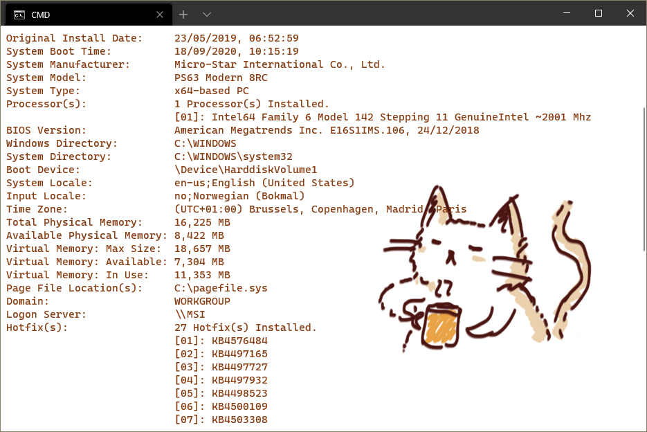

 # CoffeeMood-WindowsTerminal ☕

Windows Terminal Schema for those who enjoy the colors of coffee ✨

To make this your default windows terminal schema you need to do the following:

1. Open this directory: C:\Users\USERNAME\AppData\Local\Packages\Microsoft.WindowsTerminal_8wekyb3d8bbwe\LocalState
2. Copy your settings.json, so that you have a backup of your old settings.
3. Copy + paste all the files from this repo into the direcotry. 
4. Re-launch the WindowsTerminal
5. Make Coffee ☕

# SSH as default Terminal
1. Change line 5: "defaultProfile", to the guid of the SSH-profile.
2. Change line 25: "commandLine", to your spesific ssh connection.
3. Re-launch the WindowsTerminal

#
| Special thanks to hoppip for the GIF: https://hoppip.tumblr.com/post/83110954053

| Documentation: https://docs.microsoft.com/en-us/windows/terminal/

